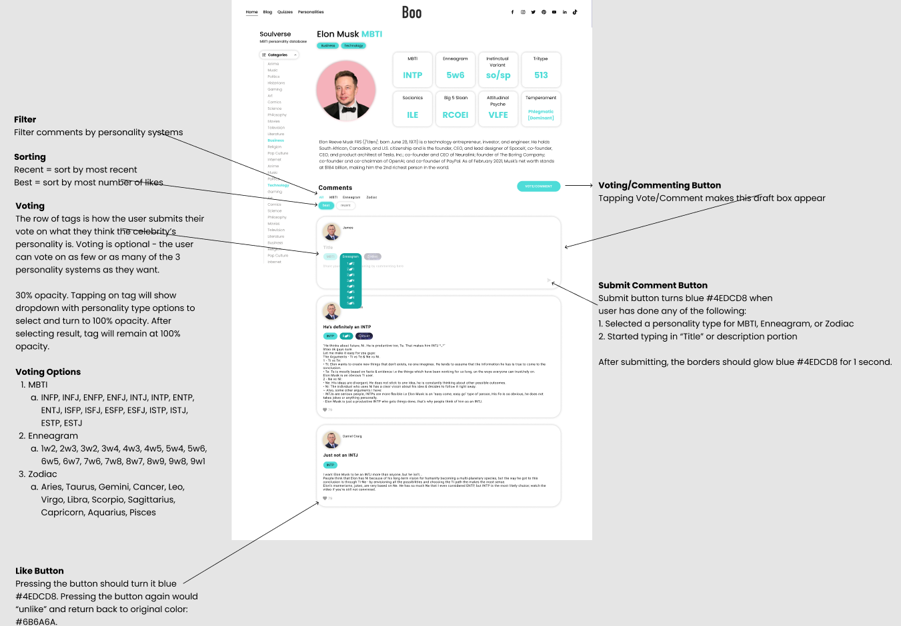
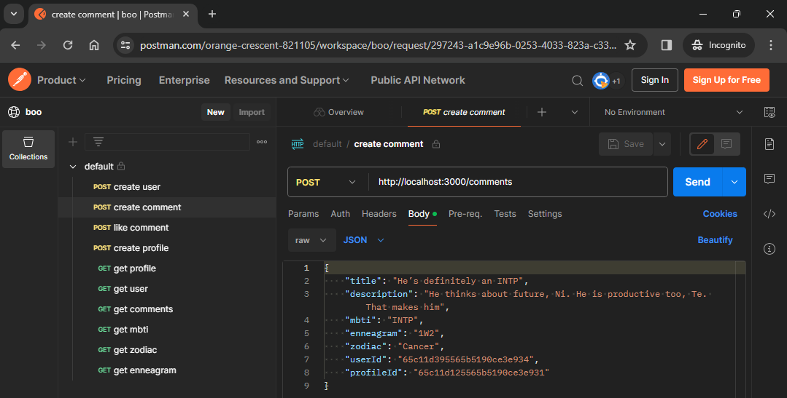
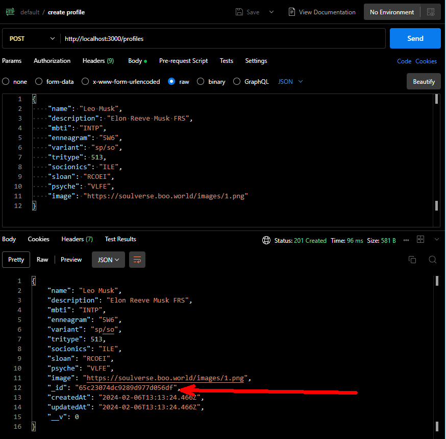
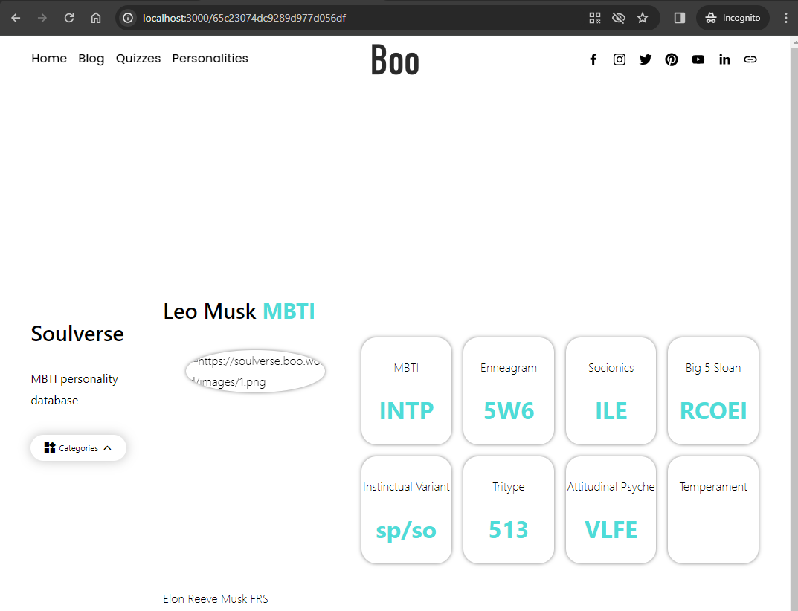

## Coding Test Instructions
Here are the instructions for the backend coding test: 
 
Starting with some node.js server code that renders a single static page using mock data you will have to:
 
#### Part 1: 
• Store the profile data in a MongoDB database instead of in memory. For ease of testing, use mongodb-memory-server ( https://github.com/nodkz/mongodb-memory-server) instead of connecting to an external database. [I've chosen to go with docker]
• Add a post route for creating new profiles. Note: you can re-use the same image for all profiles. You do not need to handle picture uploads. 
• Update the get route to handle profile ids in the url. The server should retrieve the corresponding profile from the database and render the page accordingly. 
 
#### Part 2: 
• Implement a backend API that supports the commenting and voting functionality described in this 
Figma 
• You do not need to implement the frontend. Assume that the frontend will call your  backend API in order to create user accounts, post comments, get/sort/filter comments, and like/unlike comments. 
• You do not need to implement secure auth or picture uploads. The only attribute needed for user accounts is name. Assume that anyone can access and use any user account. 
• All data should be stored in the same database used in Part 1. 

#### Part 3: 
• Add automated tests to verify the implementation of Part 1 and Part 2. 

## How I've implemented it
• I've used docker compose to install and manage the local mongodb database.
• End to end tests are implemented in the `./test/end-to-end.spec.js`
• Routes are broken into separate files in the `./routes` folder
• `./models` folder has all the mongo shcema and models definition
• `.env` file has the mongodb connection string

### Instructions on how to use the code


#### Installation

```bash
# if you use nvm - to make sure you are using the same node version I used to code this
$ nvm use

# install dependencies
$ npm install

# create/install the mongodb docker container locally
$ npm run db:dev:up

# after running npm run db:dev:up you should have a mongodb container running with an empty boo db created
# if you want to connect a mongodb client the connection url is in the .env file
```

#### Running the app

```bash
# start the app
$ npm start

# run app in watch mode
$ npm run watch

# run tests
$ npm test

```

#### Accessing with the API
I have created and shared a postman workspace [here](https://www.postman.com/orange-crescent-821105/workspace/boo) where you can see and import all endpoints with some sample data


#### Accessing the UI
Remember, that following this instruction [Update the get route to handle profile ids in the url. The server should retrieve the corresponding profile from the database and render the page accordingly.] the root url of the application is not going to work anymore. 
You will need to first add a profile, get its _id returned by the api, and use in the url. Step by Step below:
1. create Profile and copy the _id


2. use the id in the url as in http://localhost:3000/65c23074dc9289d977d056df
